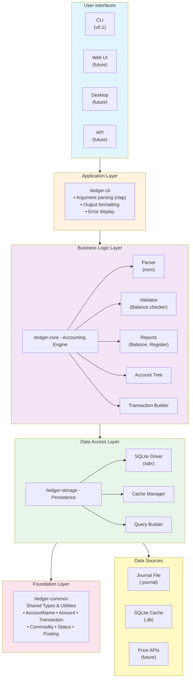
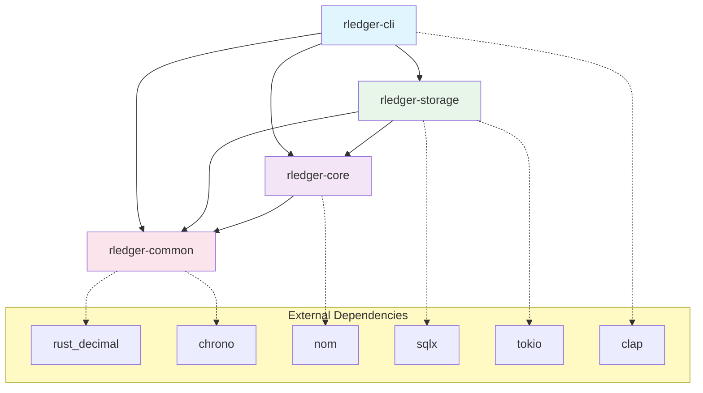
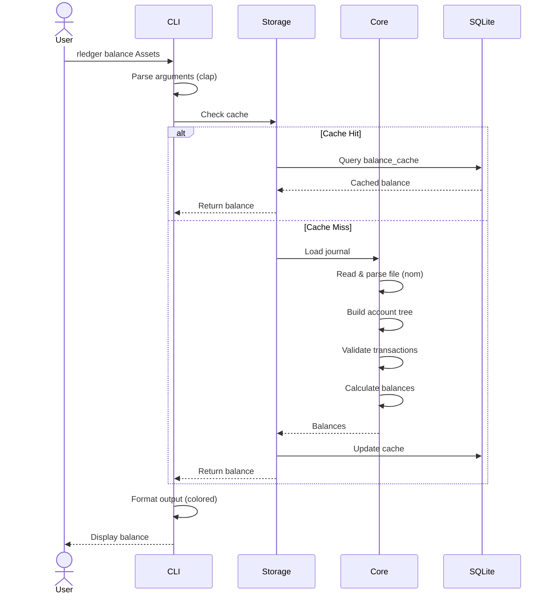
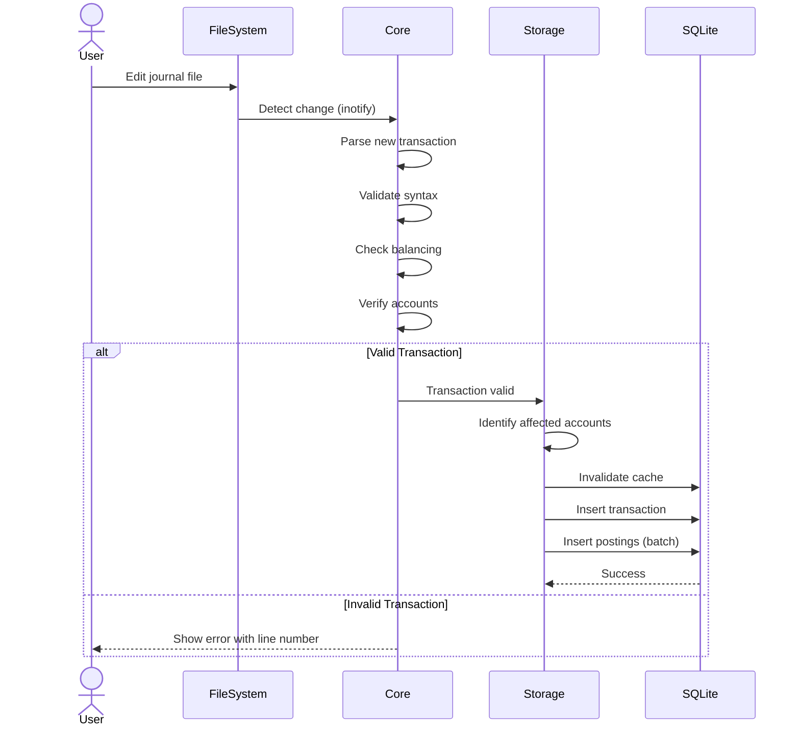
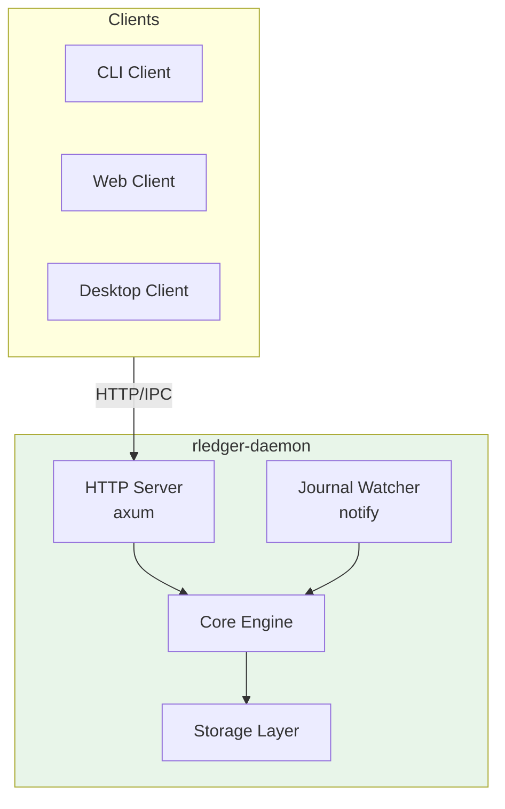
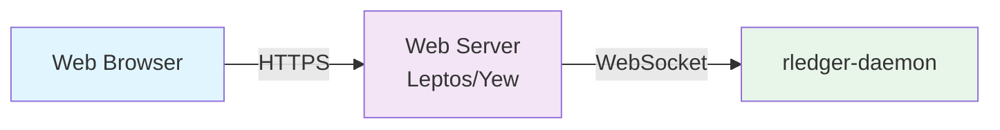
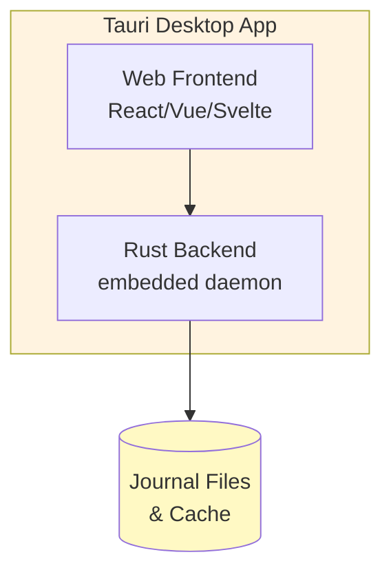
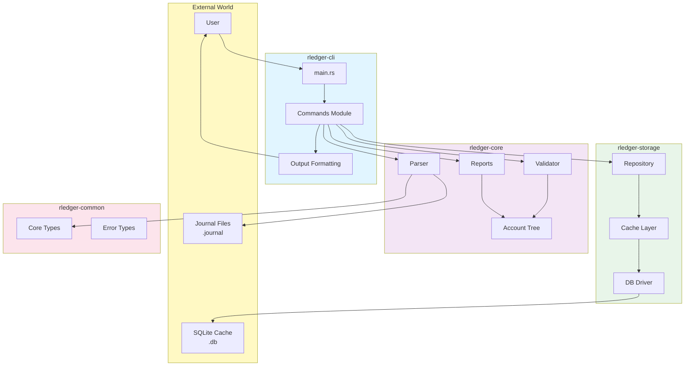

# rledger Architecture Documentation

**Version:** 0.1.0  
**Last Updated:** September 2025

---

## Table of Contents

1. [System Overview](#system-overview)
2. [High-Level Architecture](#high-level-architecture)
3. [Crate Architecture](#crate-architecture)
4. [Data Flow](#data-flow)
5. [Component Details](#component-details)
6. [Concurrency Model](#concurrency-model)
7. [Performance Architecture](#performance-architecture)
8. [Future Architecture](#future-architecture)

---

## System Overview

### What is rledger?

rledger is a plain-text accounting system that parses double-entry bookkeeping journals, validates transactions, stores data efficiently, and presents financial information through multiple interfaces (CLI, web, desktop).

### Design Goals

1. **Performance**: 10-50x faster than existing tools (GnuCash, hledger)
2. **Correctness**: Zero tolerance for accounting errors
3. **Simplicity**: Intuitive UX without sacrificing power
4. **Compatibility**: Parse existing ledger/hledger files
5. **Extensibility**: Plugin architecture for future features

### Non-Goals (Phase 1)

- Tax preparation and forms
- Multi-user concurrent editing
- Built-in bank synchronization
- Business-specific features (inventory, manufacturing)

---

## High-Level Architecture



---

## Crate Architecture

### Dependency Graph



### Crate Responsibilities

#### `rledger-common`
**Single Responsibility**: Define domain types and utilities

```
rledger-common/
├── src/
│   ├── lib.rs              # Public API surface
│   ├── types.rs            # Core types
│   │   ├── AccountName
│   │   ├── Commodity
│   │   ├── Amount
│   │   ├── Transaction
│   │   ├── Posting
│   │   └── Status
│   ├── error.rs            # Common errors
│   └── utils.rs            # Utility functions
└── tests/                  # Unit tests
```

**Key Design Decisions**:
- Newtype pattern for semantic types (prevents mixing up strings)
- All types are `Clone` (small cost, big ergonomic win)
- Serde support for future serialization needs

#### `rledger-core`
**Single Responsibility**: Parse and validate accounting data

```
rledger-core/
├── src/
│   ├── lib.rs              # Public API
│   ├── journal/            # Journal parsing
│   │   ├── mod.rs
│   │   ├── parser.rs       # nom combinators
│   │   ├── lexer.rs        # Token definitions
│   │   ├── include.rs      # Handle includes
│   │   └── directives.rs   # Parse directives
│   ├── account/            # Account management
│   │   ├── mod.rs
│   │   ├── tree.rs         # Hierarchy
│   │   ├── types.rs        # Type inference
│   │   └── query.rs        # Account queries
│   ├── transaction/        # Transaction logic
│   │   ├── mod.rs
│   │   ├── builder.rs      # Fluent builder
│   │   └── normalize.rs    # Normalization
│   ├── validation/         # Validation rules
│   │   ├── mod.rs
│   │   ├── balance.rs      # Balance checking
│   │   ├── assertions.rs   # Balance assertions
│   │   └── rules.rs        # Accounting rules
│   ├── reports/            # Report generation
│   │   ├── mod.rs
│   │   ├── balance.rs      # Balance reports
│   │   └── register.rs     # Register reports
│   └── error.rs            # Core errors
└── tests/
    ├── unit/               # Unit tests
    └── fixtures/           # Test data
```

**Key Components**:

1. **Parser** (journal/parser.rs)
   - Zero-copy parsing with nom
   - Streaming for large files
   - Comprehensive error messages with line numbers

2. **Validator** (validation/)
   - Transaction balancing
   - Balance assertions
   - Account type inference
   - Precision handling

3. **Account Tree** (account/tree.rs)
   - In-memory hierarchy
   - Parent-child relationships
   - Efficient lookups

#### `rledger-storage`
**Single Responsibility**: Persist and cache data

```
rledger-storage/
├── src/
│   ├── lib.rs              # Public API
│   ├── db/                 # Database layer
│   │   ├── mod.rs
│   │   ├── connection.rs   # Pool management
│   │   ├── schema.rs       # Table definitions
│   │   ├── migrations/     # SQL migrations
│   │   │   ├── 001_init.sql
│   │   │   └── ...
│   │   └── queries.rs      # SQL queries
│   ├── cache/              # Caching layer
│   │   ├── mod.rs
│   │   ├── balance.rs      # Balance cache
│   │   └── invalidation.rs # Cache invalidation
│   ├── repository/         # Repository pattern
│   │   ├── mod.rs
│   │   ├── accounts.rs
│   │   ├── transactions.rs
│   │   └── prices.rs
│   └── error.rs            # Storage errors
└── tests/
    └── integration/        # DB tests
```

**Key Design Patterns**:

1. **Repository Pattern**
   - Abstract data access
   - Testable without real DB
   - Clean separation from business logic

2. **Connection Pooling**
   - sqlx Pool with configurable size
   - Automatic reconnection
   - Prepared statement caching

3. **Cache Invalidation**
   - Track dependencies (transaction → accounts)
   - Invalidate on write
   - LRU eviction policy

#### `rledger-cli`
**Single Responsibility**: Command-line interface

```
rledger-cli/
├── src/
│   ├── main.rs             # Entry point
│   ├── cli.rs              # Clap definitions
│   ├── commands/           # Command handlers
│   │   ├── mod.rs
│   │   ├── balance.rs
│   │   ├── register.rs
│   │   ├── print.rs
│   │   ├── accounts.rs
│   │   └── stats.rs
│   ├── output/             # Output formatting
│   │   ├── mod.rs
│   │   ├── table.rs        # ASCII tables
│   │   ├── tree.rs         # Tree views
│   │   ├── csv.rs          # CSV export
│   │   └── json.rs         # JSON export
│   ├── config.rs           # Configuration
│   └── error.rs            # CLI errors
└── tests/
    └── integration/        # E2E tests
```

---

## Data Flow

### Read Path (Query)



### Write Path (Add Transaction)



---

## Component Details

### Parser Architecture

**Design**: Combinator-based with nom

```rust
// High-level structure
pub fn parse_journal(input: &str) -> IResult<&str, Journal> {
    many0(parse_item)(input)
}

fn parse_item(input: &str) -> IResult<&str, JournalItem> {
    alt((
        map(parse_transaction, JournalItem::Transaction),
        map(parse_directive, JournalItem::Directive),
        map(parse_comment, JournalItem::Comment),
    ))(input)
}

fn parse_transaction(input: &str) -> IResult<&str, Transaction> {
    let (input, date) = parse_date(input)?;
    let (input, _) = space1(input)?;
    let (input, status) = opt(parse_status)(input)?;
    let (input, description) = parse_description(input)?;
    let (input, postings) = many1(parse_posting)(input)?;
    
    Ok((input, Transaction {
        date,
        status: status.unwrap_or(Status::Unmarked),
        description,
        postings,
        ..Default::default()
    }))
}
```

**Performance Optimizations**:
- Zero-copy: Use `&str` slices, not `String`
- Streaming: Parse large files in chunks
- Parallel: Use rayon for multiple includes

### Validation Architecture

**Two-Pass Validation**:

1. **Syntax Validation** (during parsing)
   - Valid dates
   - Parseable amounts
   - Well-formed account names

2. **Semantic Validation** (after parsing)
   - Transaction balancing
   - Balance assertions
   - Account existence

```rust
pub struct Validator {
    precision: HashMap<Commodity, u32>,
    accounts: AccountTree,
}

impl Validator {
    pub fn validate_transaction(&self, txn: &Transaction) -> Result<()> {
        // 1. Check minimum postings
        if txn.postings.len() < 2 {
            return Err(ValidationError::TooFewPostings);
        }
        
        // 2. Check balancing
        self.check_balance(txn)?;
        
        // 3. Check assertions
        self.check_assertions(txn)?;
        
        Ok(())
    }
    
    fn check_balance(&self, txn: &Transaction) -> Result<()> {
        let mut balances: HashMap<Commodity, Decimal> = HashMap::new();
        
        for posting in &txn.postings {
            if let Some(amount) = &posting.amount {
                *balances.entry(amount.commodity.clone())
                    .or_insert(Decimal::ZERO) += amount.quantity;
            }
        }
        
        for (commodity, balance) in balances {
            let precision = self.precision.get(&commodity).unwrap_or(&2);
            let epsilon = Decimal::new(1, *precision);
            
            if balance.abs() > epsilon {
                return Err(ValidationError::UnbalancedTransaction {
                    commodity,
                    difference: balance,
                });
            }
        }
        
        Ok(())
    }
}
```

### Storage Architecture

**Schema Design Philosophy**:
- Normalized for query efficiency
- Denormalized where performance critical
- Decimal as TEXT (preserve precision)
- Indexes on query columns only

**Key Tables**:

```sql
-- Core entities
accounts(id, name, type, parent_id)
transactions(id, date, status, description)
postings(id, txn_id, acct_id, amount, commodity)

-- Performance
balance_cache(acct_id, date, commodity, balance)
CREATE INDEX idx_balance_cache_lookup 
    ON balance_cache(acct_id, date, commodity);

-- Metadata
journal_metadata(key, value)  -- File hashes, last update
```

**Query Patterns**:

```rust
// Efficient balance query
pub async fn get_balance(
    &self,
    account: &AccountName,
    as_of: NaiveDate,
) -> Result<HashMap<Commodity, Decimal>> {
    // 1. Try cache
    if let Some(cached) = self.cache.get(account, as_of).await {
        return Ok(cached);
    }
    
    // 2. Query database
    let query = r#"
        SELECT 
            p.amount_commodity,
            SUM(CAST(p.amount_quantity AS REAL))
        FROM postings p
        JOIN transactions t ON p.transaction_id = t.id
        JOIN accounts a ON p.account_id = a.id
        WHERE a.name = ? AND date(t.date) <= date(?)
        GROUP BY p.amount_commodity
    "#;
    
    let rows = sqlx::query_as::<_, (String, String)>(query)
        .bind(account.as_str())
        .bind(as_of.to_string())
        .fetch_all(&self.pool)
        .await?;
    
    let balances = rows.into_iter()
        .map(|(commodity, amount)| {
            (
                Commodity::from(commodity),
                Decimal::from_str(&amount).unwrap()
            )
        })
        .collect();
    
    // 3. Update cache
    self.cache.set(account, as_of, balances.clone()).await;
    
    Ok(balances)
}
```

---

## Concurrency Model

### Async Runtime

**Choice**: Tokio
- Most mature Rust async runtime
- Best ecosystem support
- Required by sqlx

```rust
#[tokio::main]
async fn main() -> Result<()> {
    // All I/O is async
    let pool = create_db_pool().await?;
    let journal = load_journal_async(&path).await?;
    Ok(())
}
```

### Parallel Processing

**Choice**: Rayon for CPU-bound work

```rust
use rayon::prelude::*;

// Parse multiple included files in parallel
let journals: Vec<Journal> = include_paths
    .par_iter()
    .map(|path| parse_journal_file(path))
    .collect::<Result<Vec<_>>>()?;
```

### Synchronization

**Principle**: Minimize shared mutable state

- **Parser**: Immutable, no synchronization needed
- **Validator**: Read-only after construction
- **Storage**: Connection pool handles concurrency
- **Cache**: `Arc<RwLock<HashMap>>` for in-memory cache

---

## Performance Architecture

### Critical Path Optimization

**Hot Path**: Balance query for single account

```
Total Time: ~100ms for 10k transactions

1. Parse journal       : 50ms  (50%)
2. Build account tree  : 10ms  (10%)
3. Filter postings     : 20ms  (20%)
4. Sum balances        : 10ms  (10%)
5. Format output       : 10ms  (10%)
```

**Optimizations**:
1. **Parsing**: Zero-copy, SIMD for amount parsing
2. **Tree building**: HashMap with pre-sized capacity
3. **Filtering**: Binary search on sorted transactions
4. **Summing**: SIMD for decimal addition (future)
5. **Formatting**: String buffer pre-allocation

### Memory Architecture

```
Memory Layout for 100k transactions:

Journal File        : ~20MB (plain text)
Parsed In-Memory    : ~80MB (Rust structs)
SQLite Cache        : ~40MB (indexed)
Total               : ~140MB

Target: <200MB for 1M transactions
```

**Memory Optimizations**:
- String interning for account names (60% savings)
- `Arc<Transaction>` for shared ownership
- Streaming parser for huge files (>1M txns)

### I/O Strategy

```
Read Strategy:
- <1MB files: Read entire file to String
- 1-100MB: Memory-mapped file
- >100MB: Streaming parser

Write Strategy:
- SQLite: Batch inserts (1000 txns/batch)
- WAL mode for concurrent reads during writes
- Asynchronous writes, sync reads
```

---

## Future Architecture

### Phase 2: Daemon Mode



### Phase 3: Web Interface



### Phase 4: Desktop App



---

## Architecture Decision Records (ADRs)

See [TECHNICAL_SPEC.md](./TECHNICAL_SPEC.md) for complete ADR log.

Key architectural decisions:
- **ADR-001**: Rust for implementation
- **ADR-002**: SQLite for caching, not primary storage
- **ADR-003**: nom for parsing
- **ADR-004**: rust_decimal for amounts
- **ADR-005**: Workspace with separate crates
- **ADR-006**: Rust Edition 2024

---

## Appendix: Diagrams

### Component Interaction Diagram



---

**End of Architecture Documentation**
