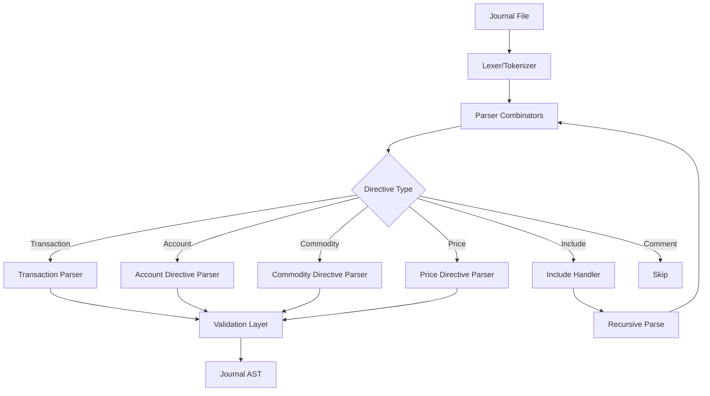
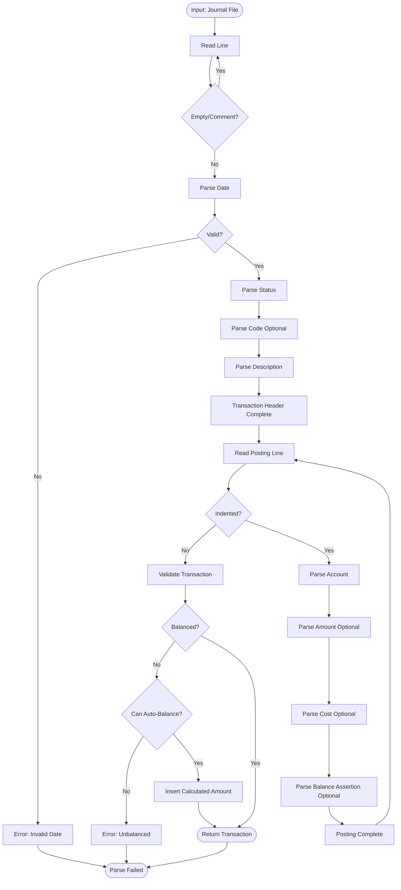
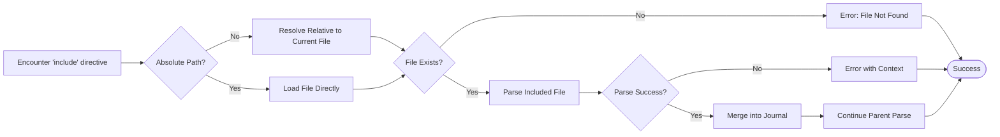
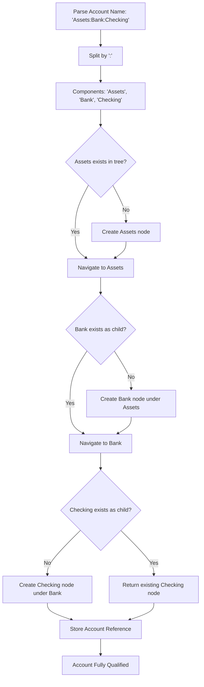

# rledger Parser Specification

**Version:** 0.1.0  
**Last Updated:** September 2025  
**Status:** Active Development

---

## Table of Contents

1. [Overview](#overview)
2. [Parser Architecture](#parser-architecture)
3. [Lexical Structure](#lexical-structure)
4. [Grammar Specification](#grammar-specification)
5. [Parsing Flow](#parsing-flow)
6. [Error Handling](#error-handling)
7. [Implementation Details](#implementation-details)
8. [Testing Strategy](#testing-strategy)
9. [Examples](#examples)

---

## Overview

### Purpose

The rledger parser transforms plain-text journal files (ledger/hledger format) into structured data models suitable for accounting operations. It prioritizes:

- **Zero-copy parsing** using nom combinators
- **Excellent error messages** with line/column information
- **80% compatibility** with ledger/hledger syntax in Phase 1
- **Performance** parsing 100k transactions in <2 seconds

### Design Philosophy

- **Fail fast**: Detect errors at parse time, not runtime
- **Strict by default**: Invalid syntax is an error, not a warning
- **Composable parsers**: Small, testable parser functions
- **Context preservation**: Track source location for all entities

---

## Parser Architecture

### High-Level Components



### Module Structure

```
rledger-core/src/journal/
├── parser.rs           # Main entry point, journal-level parser
├── lexer.rs            # Character-level primitives (whitespace, line ending)
├── transaction.rs      # Transaction and posting parsers
├── directive.rs        # Account, commodity, price directives
├── include.rs          # Include file handling
├── date.rs             # Date parsing
├── amount.rs           # Amount and commodity parsing
└── comment.rs          # Comment handling
```

---

## Lexical Structure

### Character Classes

```rust
// Whitespace (space, tab)
ws ::= ' ' | '\t'

// Line ending (LF, CRLF, or CR)
eol ::= '\n' | "\r\n" | '\r'

// Blank line
blank_line ::= ws* eol

// Comment
comment ::= ';' | '#' | '*' | '%'
line_comment ::= comment [^\n]* eol

// Digits
digit ::= [0-9]
digits ::= digit+

// Account component characters
account_char ::= [a-zA-Z0-9_-]
account_component ::= account_char+
```

### Token Types

| Token | Pattern | Example |
|-------|---------|---------|
| Date | `YYYY-MM-DD` or `YYYY/MM/DD` | `2024-01-15` |
| Status | `*` or `!` | `*` |
| Code | `(` number/text `)` | `(123)` |
| Amount | number + commodity | `$1,234.56` |
| Account | Components separated by `:` | `Assets:Checking` |
| Tag | `key:` or `key: value` | `invoice: 123` |

---

## Grammar Specification

### Journal Level

```ebnf
journal ::= journal_item* EOF

journal_item ::=
    | blank_line
    | line_comment
    | directive
    | transaction

directive ::=
    | account_directive
    | commodity_directive
    | price_directive
    | include_directive
    | default_commodity
    | default_year
```

### Transaction Grammar

```ebnf
transaction ::=
    transaction_header
    posting+
    blank_line

transaction_header ::=
    date
    (ws+ effective_date)?
    (ws+ status)?
    (ws+ code)?
    ws+ description
    (ws+ comment)?
    eol

date ::= YYYY '-' MM '-' DD | YYYY '/' MM '/' DD

effective_date ::= '=' date

status ::= '*' | '!'

code ::= '(' [^)]+ ')'

description ::= [^\n;]+

posting ::=
    ws+
    status?
    account
    (ws+ amount)?
    (ws+ cost)?
    (ws+ balance_assertion)?
    (ws+ comment)?
    eol
    tag_line*

account ::= account_component (':' account_component)*

amount ::= quantity ws* commodity | commodity ws* quantity

quantity ::= '-'? digits (',' digits)* ('.' digits+)?

commodity ::= '"' [^"]+ '"' | symbol+ | [A-Z]+

cost ::= 
    | '@' ws* amount           # Unit cost
    | '@@' ws* amount          # Total cost

balance_assertion ::= '=' ws* amount

tag_line ::= ws+ tag eol

tag ::= key ':' ws* value?

key ::= [a-z0-9_-]+

value ::= [^\n]+
```

### Directive Grammar

```ebnf
account_directive ::=
    'account' ws+ account eol
    (ws+ 'note:' ws* note eol)?
    (ws+ tag eol)*
    blank_line

commodity_directive ::=
    'commodity' ws+ commodity eol
    (ws+ 'format' ws+ format_spec eol)?
    (ws+ tag eol)*
    blank_line

price_directive ::=
    'P' ws+ date ws+ commodity ws+ amount eol

include_directive ::=
    'include' ws+ filepath eol

default_commodity ::=
    'D' ws+ amount eol

default_year ::=
    'Y' ws+ year eol
```

---

## Parsing Flow

### Transaction Parsing Pipeline



### Include File Resolution



### Account Hierarchy Building



---

## Error Handling

### Error Types

```rust
#[derive(thiserror::Error, Debug)]
pub enum ParseError {
    #[error("Invalid date format at line {line}, column {col}: '{input}'")]
    InvalidDate {
        line: usize,
        col: usize,
        input: String,
    },

    #[error("Unbalanced transaction at line {line}: {diff}")]
    UnbalancedTransaction {
        line: usize,
        diff: String,  // e.g., "$10.00 short"
    },

    #[error("Multiple postings without amounts in transaction at line {line}")]
    MultipleAutoBalance {
        line: usize,
    },

    #[error("Invalid account name at line {line}: '{name}'")]
    InvalidAccountName {
        line: usize,
        name: String,
    },

    #[error("Balance assertion failed at line {line}: expected {expected}, got {actual}")]
    BalanceAssertionFailed {
        line: usize,
        account: String,
        expected: String,
        actual: String,
    },

    #[error("Include file not found at line {line}: '{path}'")]
    IncludeFileNotFound {
        line: usize,
        path: String,
    },

    #[error("Invalid commodity at line {line}: '{commodity}'")]
    InvalidCommodity {
        line: usize,
        commodity: String,
    },

    #[error("Syntax error at line {line}, column {col}: {message}")]
    SyntaxError {
        line: usize,
        col: usize,
        message: String,
    },
}
```

### Error Recovery Strategy

**No recovery in Phase 1**: Fail fast on first error
- Clear, actionable error messages
- Line and column information
- Suggestion for fix when possible

**Example error output**:
```
Error: Invalid date format at line 42, column 1: '2024-13-01'
  |
42| 2024-13-01 * Salary
  | ^^^^^^^^^^ month must be 1-12
  |
Suggestion: Did you mean '2024-12-01'?
```

---

## Implementation Details

### nom Parser Combinators

#### Basic Parsers

```rust
use nom::{
    branch::alt,
    bytes::complete::{tag, take_while, take_while1},
    character::complete::{char, digit1, line_ending, space0, space1},
    combinator::{map, opt, recognize},
    multi::{many0, many1},
    sequence::{delimited, preceded, separated_pair, terminated, tuple},
    IResult,
};

/// Parse whitespace (space or tab)
fn ws(input: &str) -> IResult<&str, &str> {
    take_while(|c| c == ' ' || c == '\t')(input)
}

/// Parse required whitespace
fn ws1(input: &str) -> IResult<&str, &str> {
    take_while1(|c| c == ' ' || c == '\t')(input)
}

/// Parse line comment
fn line_comment(input: &str) -> IResult<&str, ()> {
    let (input, _) = alt((char(';'), char('#'), char('*'), char('%')))(input)?;
    let (input, _) = take_while(|c| c != '\n')(input)?;
    let (input, _) = line_ending(input)?;
    Ok((input, ()))
}

/// Parse date in YYYY-MM-DD or YYYY/MM/DD format
fn date(input: &str) -> IResult<&str, NaiveDate> {
    let (input, year) = map(digit1, |s: &str| s.parse::<i32>().unwrap())(input)?;
    let (input, _) = alt((char('-'), char('/')))(input)?;
    let (input, month) = map(digit1, |s: &str| s.parse::<u32>().unwrap())(input)?;
    let (input, _) = alt((char('-'), char('/')))(input)?;
    let (input, day) = map(digit1, |s: &str| s.parse::<u32>().unwrap())(input)?;
    
    NaiveDate::from_ymd_opt(year, month, day)
        .ok_or_else(|| nom::Err::Error(nom::error::Error::new(input, nom::error::ErrorKind::Verify)))
        .map(|date| (input, date))
}
```

#### Transaction Parser

```rust
/// Parse transaction status (* or !)
fn status(input: &str) -> IResult<&str, Status> {
    alt((
        map(char('*'), |_| Status::Cleared),
        map(char('!'), |_| Status::Pending),
    ))(input)
}

/// Parse transaction code in parentheses
fn code(input: &str) -> IResult<&str, String> {
    delimited(
        char('('),
        map(take_while(|c| c != ')'), String::from),
        char(')'),
    )(input)
}

/// Parse transaction header
fn transaction_header(input: &str) -> IResult<&str, TransactionHeader> {
    let (input, date) = date(input)?;
    let (input, _) = ws1(input)?;
    let (input, status) = opt(terminated(status, ws1))(input)?;
    let (input, code) = opt(terminated(code, ws1))(input)?;
    let (input, description) = take_while(|c| c != '\n' && c != ';')(input)?;
    let (input, _) = opt(preceded(ws1, line_comment))(input)?;
    let (input, _) = line_ending(input)?;
    
    Ok((input, TransactionHeader {
        date,
        status: status.unwrap_or(Status::Unmarked),
        code: code.map(String::from),
        description: description.trim().to_string(),
    }))
}
```

#### Account Parser

```rust
/// Parse account component (alphanumeric, underscore, hyphen)
fn account_component(input: &str) -> IResult<&str, &str> {
    take_while1(|c: char| c.is_alphanumeric() || c == '_' || c == '-')(input)
}

/// Parse full account name with hierarchy
fn account_name(input: &str) -> IResult<&str, AccountName> {
    let (input, components) = separated_list1(char(':'), account_component)(input)?;
    let name = components.join(":");
    Ok((input, AccountName::new(name)))
}
```

#### Amount Parser

```rust
/// Parse numeric quantity with optional thousands separators
fn quantity(input: &str) -> IResult<&str, Decimal> {
    let (input, sign) = opt(char('-'))(input)?;
    let (input, integer_part) = recognize(separated_list1(char(','), digit1))(input)?;
    let (input, decimal_part) = opt(preceded(char('.'), digit1))(input)?;
    
    let mut amount_str = integer_part.replace(',', "");
    if let Some(decimals) = decimal_part {
        amount_str.push('.');
        amount_str.push_str(decimals);
    }
    if sign.is_some() {
        amount_str.insert(0, '-');
    }
    
    let decimal = Decimal::from_str(&amount_str)
        .map_err(|_| nom::Err::Error(nom::error::Error::new(input, nom::error::ErrorKind::Digit)))?;
    
    Ok((input, decimal))
}

/// Parse commodity symbol (either quoted or unquoted)
fn commodity(input: &str) -> IResult<&str, Commodity> {
    alt((
        delimited(char('"'), take_while1(|c| c != '"'), char('"')),
        take_while1(|c: char| !c.is_whitespace() && !c.is_numeric()),
    ))(input)
    .map(|(i, s)| (i, Commodity::new(s)))
}

/// Parse amount (quantity + commodity or commodity + quantity)
fn amount(input: &str) -> IResult<&str, Amount> {
    alt((
        // Quantity first: $100.00
        map(tuple((quantity, ws, commodity)), |(q, _, c)| Amount::new(q, c)),
        // Commodity first: 100.00 USD
        map(tuple((commodity, ws, quantity)), |(c, _, q)| Amount::new(q, c)),
    ))(input)
}
```

### Context Tracking

```rust
/// Wrapper to track line and column information
pub struct Span<'a> {
    pub input: &'a str,
    pub line: usize,
    pub col: usize,
}

impl<'a> Span<'a> {
    pub fn new(input: &'a str) -> Self {
        Self { input, line: 1, col: 1 }
    }
    
    pub fn update(&mut self, consumed: &str) {
        for ch in consumed.chars() {
            if ch == '\n' {
                self.line += 1;
                self.col = 1;
            } else {
                self.col += 1;
            }
        }
    }
}

/// Parse with context tracking
pub fn parse_journal(input: &str) -> Result<Journal, ParseError> {
    let mut span = Span::new(input);
    let mut journal = Journal::default();
    
    while !span.input.is_empty() {
        match journal_item(span.input) {
            Ok((remaining, item)) => {
                let consumed = &span.input[..span.input.len() - remaining.len()];
                span.update(consumed);
                span.input = remaining;
                
                if let Some(txn) = item {
                    journal.add_transaction(txn);
                }
            }
            Err(e) => {
                return Err(ParseError::SyntaxError {
                    line: span.line,
                    col: span.col,
                    message: format!("{}", e),
                });
            }
        }
    }
    
    Ok(journal)
}
```

---

## Testing Strategy

### Unit Tests

**Test each parser function in isolation**:

```rust
#[cfg(test)]
mod tests {
    use super::*;
    
    #[test]
    fn test_parse_date_valid() {
        assert_eq!(
            date("2024-01-15"),
            Ok(("", NaiveDate::from_ymd_opt(2024, 1, 15).unwrap()))
        );
    }
    
    #[test]
    fn test_parse_date_invalid_month() {
        assert!(date("2024-13-01").is_err());
    }
    
    #[test]
    fn test_parse_amount_symbol_prefix() {
        let result = amount("$123.45").unwrap().1;
        assert_eq!(result.quantity, Decimal::new(12345, 2));
        assert_eq!(result.commodity.as_str(), "$");
    }
    
    #[test]
    fn test_parse_amount_symbol_suffix() {
        let result = amount("123.45 USD").unwrap().1;
        assert_eq!(result.quantity, Decimal::new(12345, 2));
        assert_eq!(result.commodity.as_str(), "USD");
    }
    
    #[test]
    fn test_parse_account_hierarchy() {
        let result = account_name("Assets:Bank:Checking").unwrap().1;
        assert_eq!(result.as_str(), "Assets:Bank:Checking");
        assert_eq!(result.components(), vec!["Assets", "Bank", "Checking"]);
    }
}
```

### Property-Based Tests

```rust
use proptest::prelude::*;

proptest! {
    #[test]
    fn test_date_roundtrip(
        year in 2000i32..2100,
        month in 1u32..=12,
        day in 1u32..=28
    ) {
        let date = NaiveDate::from_ymd_opt(year, month, day).unwrap();
        let formatted = format!("{}", date.format("%Y-%m-%d"));
        let (_, parsed) = date(&formatted).unwrap();
        prop_assert_eq!(date, parsed);
    }
    
    #[test]
    fn test_amount_parsing(
        quantity in -1000000i64..1000000i64,
        decimals in 0u32..100u32
    ) {
        let decimal = Decimal::new(quantity, decimals.min(28));
        let formatted = format!("{} USD", decimal);
        let (_, parsed) = amount(&formatted).unwrap();
        prop_assert_eq!(parsed.quantity, decimal);
    }
}
```

### Integration Tests

```rust
#[test]
fn test_parse_full_transaction() {
    let input = r#"2024-01-15 * (123) Salary
    Assets:Checking          $1,500.00
    Income:Salary           $-1,500.00
"#;
    
    let (_, txn) = transaction(input).unwrap();
    assert_eq!(txn.date, NaiveDate::from_ymd_opt(2024, 1, 15).unwrap());
    assert_eq!(txn.status, Status::Cleared);
    assert_eq!(txn.code, Some("123".to_string()));
    assert_eq!(txn.description, "Salary");
    assert_eq!(txn.postings.len(), 2);
}

#[test]
fn test_parse_auto_balance() {
    let input = r#"2024-01-15 * Salary
    Assets:Checking          $1,500.00
    Income:Salary
"#;
    
    let (_, mut txn) = transaction(input).unwrap();
    txn.auto_balance().unwrap();
    
    assert_eq!(txn.postings[1].amount.unwrap().quantity, Decimal::new(-150000, 2));
}
```

### Compatibility Tests

```rust
#[test]
fn test_ledger_compatibility() {
    // Load real ledger file
    let ledger_content = std::fs::read_to_string("tests/fixtures/example.ledger").unwrap();
    
    // Parse with rledger
    let journal = parse_journal(&ledger_content).unwrap();
    
    // Verify transaction count matches
    assert_eq!(journal.transactions.len(), 42);
    
    // Verify balance calculations match expected
    // (Compare against pre-computed values from ledger)
}
```

---

## Examples

### Example 1: Simple Transaction

**Input**:
```ledger
2024-01-15 * Grocery Shopping
    Expenses:Food:Groceries      $87.32
    Assets:Checking
```

**Parsed AST**:
```rust
Transaction {
    date: NaiveDate::from_ymd(2024, 1, 15),
    status: Status::Cleared,
    code: None,
    description: "Grocery Shopping".to_string(),
    postings: vec![
        Posting {
            account: AccountName::new("Expenses:Food:Groceries"),
            amount: Some(Amount::new(Decimal::new(8732, 2), "$")),
            cost: None,
            balance_assertion: None,
        },
        Posting {
            account: AccountName::new("Assets:Checking"),
            amount: None,  // Will be auto-balanced to -$87.32
            cost: None,
            balance_assertion: None,
        },
    ],
    metadata: HashMap::new(),
}
```

### Example 2: Transaction with Cost

**Input**:
```ledger
2024-01-20 * Buy AAPL
    Assets:Investments:Stocks    10 AAPL @ $150.00
    Assets:Checking             $-1,500.00
```

**Parsed AST**:
```rust
Transaction {
    date: NaiveDate::from_ymd(2024, 1, 20),
    status: Status::Cleared,
    code: None,
    description: "Buy AAPL".to_string(),
    postings: vec![
        Posting {
            account: AccountName::new("Assets:Investments:Stocks"),
            amount: Some(Amount::new(Decimal::new(10, 0), "AAPL")),
            cost: Some(Cost::PerUnit(Amount::new(Decimal::new(15000, 2), "$"))),
            balance_assertion: None,
        },
        Posting {
            account: AccountName::new("Assets:Checking"),
            amount: Some(Amount::new(Decimal::new(-150000, 2), "$")),
            cost: None,
            balance_assertion: None,
        },
    ],
    metadata: HashMap::new(),
}
```

### Example 3: Balance Assertion

**Input**:
```ledger
2024-01-25 * Paycheck
    Assets:Checking          $2,000.00 = $5,432.00
    Income:Salary
```

**Parsed AST**:
```rust
Transaction {
    date: NaiveDate::from_ymd(2024, 1, 25),
    status: Status::Cleared,
    code: None,
    description: "Paycheck".to_string(),
    postings: vec![
        Posting {
            account: AccountName::new("Assets:Checking"),
            amount: Some(Amount::new(Decimal::new(200000, 2), "$")),
            cost: None,
            balance_assertion: Some(Amount::new(Decimal::new(543200, 2), "$")),
        },
        Posting {
            account: AccountName::new("Income:Salary"),
            amount: None,
            cost: None,
            balance_assertion: None,
        },
    ],
    metadata: HashMap::new(),
}
```

### Example 4: Include Directive

**Input** (`main.ledger`):
```ledger
; Main journal file
include 2024/january.ledger
include 2024/february.ledger
```

**Input** (`2024/january.ledger`):
```ledger
2024-01-01 * Opening Balance
    Assets:Checking    $1,000.00
    Equity:Opening
```

**Parsing Flow**:
1. Parse `main.ledger`
2. Encounter `include 2024/january.ledger`
3. Resolve path relative to `main.ledger`
4. Recursively parse `2024/january.ledger`
5. Merge transactions into main journal
6. Continue parsing `main.ledger`

---

## Performance Considerations

### Zero-Copy Parsing

- Use `&str` slices instead of `String` where possible
- Defer string allocation until absolutely necessary
- Use `Cow<str>` for optional ownership

### Parallel Processing

Phase 2 optimization: Parse multiple files in parallel
```rust
use rayon::prelude::*;

fn parse_journal_parallel(files: &[PathBuf]) -> Result<Journal> {
    let journals: Vec<Journal> = files
        .par_iter()
        .map(|path| parse_file(path))
        .collect::<Result<Vec<_>>>()?;
    
    merge_journals(journals)
}
```

### Benchmark Targets

| Input Size | Target Parse Time | Memory Usage |
|------------|-------------------|--------------|
| 1k txns | <20ms | <10MB |
| 10k txns | <200ms | <50MB |
| 100k txns | <2s | <100MB |

---

## Future Enhancements

### Phase 2
- [ ] Automated transactions
- [ ] Periodic transactions
- [ ] Value expressions
- [ ] Virtual postings (in parentheses/brackets)

### Phase 3
- [ ] Python expression support
- [ ] Custom commodity formats
- [ ] Lot tracking syntax

---

**End of Parser Specification**

*This document defines the authoritative parser behavior. All implementations must conform to this spec.*
